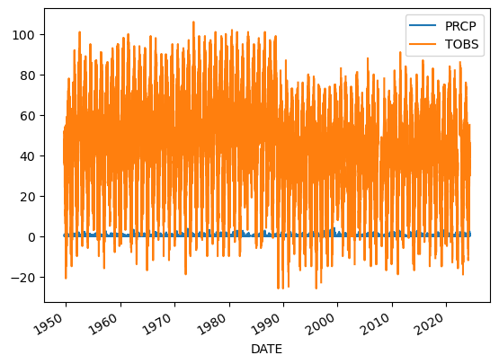
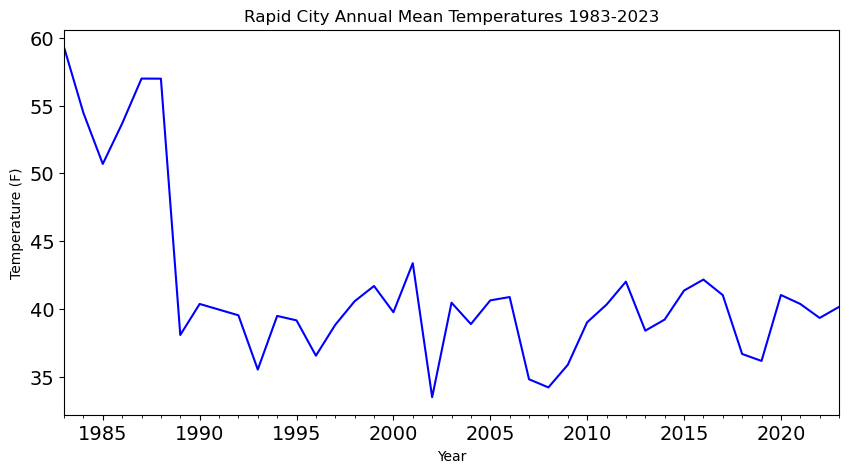
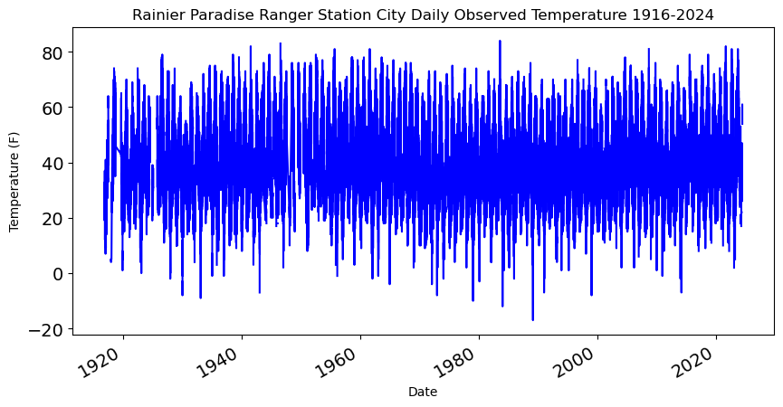
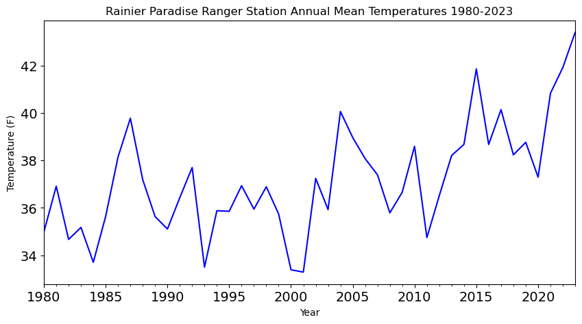

# Climate change is impacting the way people live around the world

::: {.cell .markdown}

Higher highs, lower lows, storms, and smoke – we’re all feeling the
effects of climate change. In this workflow, you will take a look at
trends in temperature over time in Rapid City, SD.

> **Important**
>
> [Read about some of the effects of – and solutions for – climate
> change on the Pine Ridge Reservation southeast of Rapid
> City.](https://www.theguardian.com/environment/2022/dec/03/south-dakota-reservation-food-desert-residents-transforming-crop-oasis)

## Get started with open reproducible science!

[Open reproducible
science](https://www.earthdatascience.org/courses/intro-to-earth-data-science/open-reproducible-science/get-started-open-reproducible-science/)
makes scientific methods, data and outcomes available to everyone. That
means that *everyone* who wants should be able to **find**, **read**,
**understand**, and **run** your workflows for themselves.


> Image from
> https://www.earthdata.nasa.gov/esds/open-science/oss-for-eso-workshops

Few if any science projects are 100% open and reproducible (yet!).
However, members of the open science community have developed open
source tools and practices that can help you move toward that goal. You
will learn about many of those tools in [the Intro to Earth Data Science
textbook](https://www.earthdatascience.org/courses/intro-to-earth-data-science/).
Don’t worry about learning all the tools at once – we’ve picked a few
for you to get started with.

------------------------------------------------------------------------

> **<i class="fa fa-solid fa-glasses fa-large" aria-label="glasses"></i>
> Further reading**
>
> Read [our textbook chapter about open reproducible
> science](https://www.earthdatascience.org/courses/intro-to-earth-data-science/open-reproducible-science/get-started-open-reproducible-science/).

> **<i class="fa fa-solid fa-pencil fa-large" aria-label="pencil"></i>
> What does open reproducible science mean to you?**
>
> <i class="far fa-regular fa-square" aria-label="square"></i> Create a
> new Markdown cell below this one using the `+ Markdown` button in the
> upper left.
>
> <i class="far fa-regular fa-square" aria-label="square"></i> In the
> new cell, answer the following questions using a **numbered list** in
> Markdown:
>
> 1.  In 1-2 sentences, define open reproducible science.
> 2.  In 1-2 sentences, choose one of the open source tools that you
>     have learned about (i.e. Shell, Git/GitHub, Jupyter Notebook,
>     Python) and explain how it supports open reproducible science.

1. Open reproducible science is about making research, it's methods and outcomes, available to anyone. This includes that the research can be repeated, the data used is available to the public, and there is transparency around the methods and results.
2. GitHub supports open and reproducible science because it allows a space where findings can be shared easily with the public and other researchers. With GitHub's functionality of codespaces and the ability to fork code, it allows for others to take your code, use it, add onto it, and continue to progress research.


## <i class="fa fa-solid fa-pencil fa-large" aria-label="pencil"></i> Human-readable and Machine-readable

<i class="far fa-regular fa-square" aria-label="square"></i> Create a
new Markdown cell below this one using the <kbd>ESC</kbd> + <kbd>b</kbd>
keyboard shortcut.

<i class="far fa-regular fa-square" aria-label="square"></i> In the new
cell, answer the following question in a Markdown **quote**: In 1-2
sentences, does this Jupyter Notebook file have a machine-readable name?
Explain your answer.

> This Jupyter notebook doesn't have a machine-readable name because it has spaces and an exclimation point in the name. 

------------------------------------------------------------------------

## What the fork?! Who wrote this?

Below is a scientific Python workflow. But something’s wrong – The code
won’t run! Your task is to follow the instructions below to **clean and
debug** the Python code below so that it runs.

> **Tip**
>
> Don’t worry if you can’t solve every bug right away. We’ll get there!
> The most important thing is to identify problems with the code and
> write high-quality [**GitHub
> Issues**](https://docs.github.com/en/issues/tracking-your-work-with-issues/creating-an-issue#creating-an-issue-from-a-repository).

At the end, you’ll **repeat the workflow** for a location and
measurement of your choosing.

Alright! Let’s clean up this code. First things first…

> **<i class="fa fa-solid fa-keyboard fa-large" aria-label="keyboard"></i>
> Machine-readable file names**
>
> Rename this notebook (if necessary) with an [**expressive and
> machine-readable file
> name**](https://www.earthdatascience.org/courses/intro-to-earth-data-science/open-reproducible-science/get-started-open-reproducible-science/best-practices-for-organizing-open-reproducible-science/)

------------------------------------------------------------------------

## Python **packages** let you use code written by experts around the world

Because Python is open source, lots of different people and
organizations can contribute (including you!). Many contributions are in
the form of **packages** which do not come with a standard Python
download.

> **<i class="fa fa-solid fa-glasses fa-large" aria-label="glasses"></i>
> Read more**
>
> [Packages need to be installed and
> **imported**](https://www.earthdatascience.org/courses/intro-to-earth-data-science/python-code-fundamentals/use-python-packages/).

In the cell below, someone was trying to import the **pandas package**,
which helps us to work with [**tabular data** such as comma-separated
value or csv
files](https://www.earthdatascience.org/courses/intro-to-earth-data-science/file-formats/use-text-files/).

> **<i class="fa fa-solid fa-keyboard fa-large" aria-label="keyboard"></i>
> Your task**
>
> 1.  Correct the typo below to properly import the pandas package under
>     its **alias** pd.
> 2.  Run the cell to import pandas
>
> NOTE: **Run your code in the right **environment\*\* to avoid import
> errors\*\*
>
> We’ve created a coding **environment** for you to use that already has
> all the software and libraries you will need! When you try to run some
> code, you may be prompted to select a **kernel**. The **kernel**
> refers to the version of Python you are using. You should use the
> **base** kernel, which should be the default option.


```python
# Import pandas
import pandas as pd
```

Once you have run the cell above and imported `pandas`, **run the cell
below**. It is a test cell that will tell you if you completed the task
successfully. If a test cell isn’t working the way you expect, check
that you ran your code **immediately before** running the test.


```python
# DO NOT MODIFY THIS TEST CELL
points = 0
try:
    pd.DataFrame()
    points += 5
    print('\u2705 Great work! You correctly imported the pandas library.')
except:
    print('\u274C Oops - pandas was not imported correctly.')
print('You earned {} of 5 points for importing pandas'.format(points))
```

    ✅ Great work! You correctly imported the pandas library.
    You earned 5 of 5 points for importing pandas


------------------------------------------------------------------------

## There are more Earth Observation data online than any one person could ever look at

[NASA’s Earth Observing System Data and Information System (EOSDIS)
alone manages over 9PB of
data](https://www.earthdata.nasa.gov/learn/articles/getting-petabytes-people-how-eosdis-facilitates-earth-observing-data-discovery-and-use).
1 PB is roughly 100 times the entire Library of Congress (a good
approximation of all the books available in the US). It’s all available
to **you** once you learn how to download what you want.

Here we’re using the NOAA National Centers for Environmental Information
(NCEI) [Access Data
Service](https://www.ncei.noaa.gov/support/access-data-service-api-user-documentation)
application progamming interface (API) to request data from their web
servers. We will be using data collected as part of the Global
Historical Climatology Network daily (GHCNd) from their [Climate Data
Online library](https://www.ncdc.noaa.gov/cdo-web/datasets) program at
NOAA.

For this example we’re requesting [daily summary data in Rapid City, CO
(station ID
USC00396947)](https://www.ncdc.noaa.gov/cdo-web/datasets/GHCND/stations/GHCND:USC00396947/detail).

> **<i class="fa fa-solid fa-pencil fa-large" aria-label="pencil"></i>
> Your task:**
>
> 1.  Research the [**Global Historical Climatology Network -
>     Daily**](https://www.ncei.noaa.gov/metadata/geoportal/rest/metadata/item/gov.noaa.ncdc:C00861/html)
>     data source.
> 2.  In the cell below, write a 2-3 sentence description of the data
>     source. You should describe:
>     -   who takes the data
>     -   where the data were taken
>     -   what the maximum temperature units are
>     -   how the data are collected
> 3.  Include a citation of the data (**HINT:** See the ‘Data Citation’
>     tab on the GHCNd overview page).

The data is taken from 30 different sources at climate stations around the world. Over 25,000 stations are regularly updated with observations from within roughly the last month. The dataset includes observations from World Meteorological Organization, Cooperative, and CoCoRaHS networks. NOAA's National Centers for Environmental Information houses this data. The maximum temperature units is tenths of degrees C. The dataset is also routinely reconstructed (usually every week) from its roughly 30 data sources to ensure that GHCN-Daily is generally in sync with its growing list of constituent sources. The data is collected from climate stations around the world.

Citation:
Menne, Matthew J., Imke Durre, Bryant Korzeniewski, Shelley McNeill, Kristy Thomas, Xungang Yin, Steven Anthony, Ron Ray, Russell S. Vose, Byron E.Gleason, and Tamara G. Houston (2012): Global Historical Climatology Network - Daily (GHCN-Daily), Version 3. [indicate subset used]. NOAA National Climatic Data Center. doi:10.7289/V5D21VHZ [May 13, 2024].

## You can access NCEI GHCNd Data from the internet using its API 🖥️ 📡 🖥️

The cell below contains the URL for the data you will use in this part
of the notebook. We created this URL by generating what is called an
**API endpoint** using the NCEI [API
documentation](https://www.ncei.noaa.gov/support/access-data-service-api-user-documentation).

> **Note**
>
> An **application programming interface** (API) is a way for two or
> more computer programs or components to communicate with each other.
> It is a type of software interface, offering a service to other pieces
> of software ([Wikipedia](https://en.wikipedia.org/wiki/API)).

However, we still have a problem - we can’t get the URL back later on
because it isn’t saved in a **variable**. In other words, we need to
give the url a name so that we can request in from Python later (sadly,
Python has no ‘hey what was that thingy I typed yesterday?’ function).

> **<i class="fa fa-solid fa-glasses fa-large" aria-label="glasses"></i>
> Read more**
>
> Check out the [textbook section on
> variables](https://www.earthdatascience.org/courses/intro-to-earth-data-science/python-code-fundamentals/get-started-using-python/variables/)

> **<i class="fa fa-solid fa-keyboard fa-large" aria-label="keyboard"></i>
> Your task**
>
> 1.  Pick an expressive variable name for the URL. HINT: click on the
>     `Variables` button up top to see all your variables. Your new url
>     variable will not be there until you define it and run the code
> 2.  Reformat the URL so that it adheres to the [79-character PEP-8
>     line
>     limit](https://peps.python.org/pep-0008/#maximum-line-length).You
>     should see two vertical lines in each cell - don’t let your code
>     go past the second line
> 3.  At the end of the cell where you define your url variable, **call
>     your variable (type out its name)** so it can be tested.


```python
rapidcityurl = (
    'https://www.ncei.noaa.gov/access/services/data/v1?'
    'dataset=daily-summaries'
    '&dataTypes=TOBS,PRCP'
    '&stations=USC00396947'
    '&startDate=1949-10-01'
    '&endDate=2024-05-03'
    '&includeStationName=true'
    '&includeStationLocation=1'
    '&units=standard')
rapidcityurl
```


    'https://www.ncei.noaa.gov/access/services/data/v1?dataset=daily-summaries&dataTypes=TOBS,PRCP&stations=USC00396947&startDate=1949-10-01&endDate=2024-05-03&includeStationName=true&includeStationLocation=1&units=standard'


```python
# DO NOT MODIFY THIS TEST CELL
resp_url = _
points = 0

if type(resp_url)==str:
    points += 3
    print('\u2705 Great work! You correctly called your url variable.')
else:
    print('\u274C Oops - your url variable was not called correctly.')

if len(resp_url)==218:
    points += 3
    print('\u2705 Great work! Your url is the correct length.')
else:
    print('\u274C Oops - your url variable is not the correct length.')

print('You earned {} of 6 points for defining a url variable'.format(points))
```

    ✅ Great work! You correctly called your url variable.
    ✅ Great work! Your url is the correct length.
    You earned 6 of 6 points for defining a url variable


------------------------------------------------------------------------

## **Download and get started working with NCEI data**

The `pandas` library you imported can download data from the internet
directly into a type of Python **object** called a `DataFrame`. In the
code cell below, you can see an attempt to do just this. But there are
some problems…

> **<i class="fa fa-solid fa-keyboard fa-large" aria-label="keyboard"></i>
> You’re ready to fix some code!**
>
> Your task is to:
>
> 1.  Leave a space between the `#` and text in the comment and try
>     making the comment more informative
>
> 2.  Make any changes needed to get this code to run. HINT: The
>     `my_url` variable doesn’t exist - you need to replace it with the
>     variable name **you** chose.
>
> 3.  Modify the `.read_csv()` statement to include the following
>     parameters:
>
>     -   `index_col='DATE'` – this sets the `DATE` column as the index.
>         Needed for subsetting and resampling later on
>     -   `parse_dates=True` – this lets `python` know that you are
>         working with time-series data, and values in the indexed
>         column are **date time objects**
>     -   `na_values=['NaN']` – this lets `python` know how to handle
>         missing values
>
> 4.  Clean up the code by using **expressive variable names**,
>     **expressive column names**, **PEP-8 compliant code**, and
>     **descriptive comments**

**Make sure to call your `DataFrame` by typing it’s name as the last
line of your code cell** Then, you will be able to run the test cell
below and find out if your answer is correct.


```python
# creating a data frame for Rapid City
rapidcity_df = pd.read_csv(
  rapidcityurl,
  index_col='DATE',
  parse_dates=True,
  na_values=['NaN'])
rapidcity_df
```


<div>
<style scoped>
    .dataframe tbody tr th:only-of-type {
        vertical-align: middle;
    }

    .dataframe tbody tr th {
        vertical-align: top;
    }

    .dataframe thead th {
        text-align: right;
    }
</style>
<table border="1" class="dataframe">
  <thead>
    <tr style="text-align: right;">
      <th></th>
      <th>STATION</th>
      <th>NAME</th>
      <th>LATITUDE</th>
      <th>LONGITUDE</th>
      <th>ELEVATION</th>
      <th>PRCP</th>
      <th>TOBS</th>
    </tr>
    <tr>
      <th>DATE</th>
      <th></th>
      <th></th>
      <th></th>
      <th></th>
      <th></th>
      <th></th>
      <th></th>
    </tr>
  </thead>
  <tbody>
    <tr>
      <th>1949-10-01</th>
      <td>USC00396947</td>
      <td>RAPID CITY 4 NW, SD US</td>
      <td>44.12055</td>
      <td>-103.28417</td>
      <td>1060.4</td>
      <td>0.00</td>
      <td>51.0</td>
    </tr>
    <tr>
      <th>1949-10-02</th>
      <td>USC00396947</td>
      <td>RAPID CITY 4 NW, SD US</td>
      <td>44.12055</td>
      <td>-103.28417</td>
      <td>1060.4</td>
      <td>0.00</td>
      <td>51.0</td>
    </tr>
    <tr>
      <th>1949-10-03</th>
      <td>USC00396947</td>
      <td>RAPID CITY 4 NW, SD US</td>
      <td>44.12055</td>
      <td>-103.28417</td>
      <td>1060.4</td>
      <td>0.00</td>
      <td>52.0</td>
    </tr>
    <tr>
      <th>1949-10-04</th>
      <td>USC00396947</td>
      <td>RAPID CITY 4 NW, SD US</td>
      <td>44.12055</td>
      <td>-103.28417</td>
      <td>1060.4</td>
      <td>0.00</td>
      <td>45.0</td>
    </tr>
    <tr>
      <th>1949-10-05</th>
      <td>USC00396947</td>
      <td>RAPID CITY 4 NW, SD US</td>
      <td>44.12055</td>
      <td>-103.28417</td>
      <td>1060.4</td>
      <td>0.00</td>
      <td>50.0</td>
    </tr>
    <tr>
      <th>...</th>
      <td>...</td>
      <td>...</td>
      <td>...</td>
      <td>...</td>
      <td>...</td>
      <td>...</td>
      <td>...</td>
    </tr>
    <tr>
      <th>2024-04-28</th>
      <td>USC00396947</td>
      <td>RAPID CITY 4 NW, SD US</td>
      <td>44.12055</td>
      <td>-103.28417</td>
      <td>1060.4</td>
      <td>0.00</td>
      <td>NaN</td>
    </tr>
    <tr>
      <th>2024-04-29</th>
      <td>USC00396947</td>
      <td>RAPID CITY 4 NW, SD US</td>
      <td>44.12055</td>
      <td>-103.28417</td>
      <td>1060.4</td>
      <td>0.37</td>
      <td>30.0</td>
    </tr>
    <tr>
      <th>2024-04-30</th>
      <td>USC00396947</td>
      <td>RAPID CITY 4 NW, SD US</td>
      <td>44.12055</td>
      <td>-103.28417</td>
      <td>1060.4</td>
      <td>0.00</td>
      <td>44.0</td>
    </tr>
    <tr>
      <th>2024-05-01</th>
      <td>USC00396947</td>
      <td>RAPID CITY 4 NW, SD US</td>
      <td>44.12055</td>
      <td>-103.28417</td>
      <td>1060.4</td>
      <td>0.00</td>
      <td>33.0</td>
    </tr>
    <tr>
      <th>2024-05-02</th>
      <td>USC00396947</td>
      <td>RAPID CITY 4 NW, SD US</td>
      <td>44.12055</td>
      <td>-103.28417</td>
      <td>1060.4</td>
      <td>0.35</td>
      <td>39.0</td>
    </tr>
  </tbody>
</table>
<p>26109 rows × 7 columns</p>
</div>


```python
# DO NOT MODIFY THIS TEST CELL
tmax_df_resp = _
points = 0

if isinstance(tmax_df_resp, pd.DataFrame):
    points += 1
    print('\u2705 Great work! You called a DataFrame.')
else:
    print('\u274C Oops - make sure to call your DataFrame for testing.')

print('You earned {} of 2 points for downloading data'.format(points))
```

    ✅ Great work! You called a DataFrame.
    You earned 1 of 2 points for downloading data


> HINT: Check out the `type()` function below - you can use it to check
> that your data is now in `DataFrame` type object


```python
# Check that the data was imported into a pandas DataFrame
type(rapidcity_df)
```


    pandas.core.frame.DataFrame


> **<i class="fa fa-solid fa-keyboard fa-large" aria-label="keyboard"></i>
> Clean up your DataFrame**
>
> Use double brackets to only select the columns you want in your
> DataFrame

**Make sure to call your `DataFrame` by typing it’s name as the last
line of your code cell** Then, you will be able to run the test cell
below and find out if your answer is correct.


```python
rapidcity_df.columns
```


    Index(['STATION', 'NAME', 'LATITUDE', 'LONGITUDE', 'ELEVATION', 'PRCP',
           'TOBS'],
          dtype='object')


```python
rapidcity_df = rapidcity_df[['PRCP', 'TOBS']]
rapidcity_df
```


<div>
<style scoped>
    .dataframe tbody tr th:only-of-type {
        vertical-align: middle;
    }

    .dataframe tbody tr th {
        vertical-align: top;
    }

    .dataframe thead th {
        text-align: right;
    }
</style>
<table border="1" class="dataframe">
  <thead>
    <tr style="text-align: right;">
      <th></th>
      <th>PRCP</th>
      <th>TOBS</th>
    </tr>
    <tr>
      <th>DATE</th>
      <th></th>
      <th></th>
    </tr>
  </thead>
  <tbody>
    <tr>
      <th>1949-10-01</th>
      <td>0.00</td>
      <td>51.0</td>
    </tr>
    <tr>
      <th>1949-10-02</th>
      <td>0.00</td>
      <td>51.0</td>
    </tr>
    <tr>
      <th>1949-10-03</th>
      <td>0.00</td>
      <td>52.0</td>
    </tr>
    <tr>
      <th>1949-10-04</th>
      <td>0.00</td>
      <td>45.0</td>
    </tr>
    <tr>
      <th>1949-10-05</th>
      <td>0.00</td>
      <td>50.0</td>
    </tr>
    <tr>
      <th>...</th>
      <td>...</td>
      <td>...</td>
    </tr>
    <tr>
      <th>2024-04-28</th>
      <td>0.00</td>
      <td>NaN</td>
    </tr>
    <tr>
      <th>2024-04-29</th>
      <td>0.37</td>
      <td>30.0</td>
    </tr>
    <tr>
      <th>2024-04-30</th>
      <td>0.00</td>
      <td>44.0</td>
    </tr>
    <tr>
      <th>2024-05-01</th>
      <td>0.00</td>
      <td>33.0</td>
    </tr>
    <tr>
      <th>2024-05-02</th>
      <td>0.35</td>
      <td>39.0</td>
    </tr>
  </tbody>
</table>
<p>26109 rows × 2 columns</p>
</div>


```python
# DO NOT MODIFY THIS TEST CELL
tmax_df_resp = _
points = 0

summary = [round(val, 2) for val in tmax_df_resp.mean().values]
if summary == [0.05, 54.53]:
    points += 4
    print('\u2705 Great work! You correctly downloaded data.')
else:
    print('\u274C Oops - your data are not correct.')
print('You earned {} of 5 points for downloading data'.format(points))
```

    ❌ Oops - your data are not correct.
    You earned 0 of 5 points for downloading data


------------------------------------------------------------------------

## Plot the precpitation column (PRCP) vs time to explore the data

Plotting in Python is easy, but not quite this easy:


```python
rapidcity_df.plot()
```


    <Axes: xlabel='DATE'>


    

    


> ****Label and describe your plots****
>
> <figure>
>  alt="Source: https://xkcd.com/833" />
> <figcaption aria-hidden="true">Source: https://xkcd.com/833</figcaption>
> </figure>
>
> Make sure each plot has:
>
> -   A title that explains where and when the data are from
> -   x- and y- axis labels with **units** where appropriate
> -   A legend where appropriate

You’ll always need to add some instructions on labels and how you want
your plot to look.

> **<i class="fa fa-solid fa-keyboard fa-large" aria-label="keyboard"></i>
> Your task:**
>
> 1.  Change `dataframe` to **your** `DataFrame` name.
> 2.  Change `y=` to the name of your **observed temperature** column
>     name.
> 3.  Use the `title`, `ylabel`, and `xlabel` parameters to add key text
>     to your plot.
> 4.  Adjust the size of your figure using `figsize=(x,y)` where `x` is
>     figure width and `y` is figure height
>
> > **HINT:** labels have to be a *type* in Python called a **string**.
> > You can make a string by putting quotes around your label, just like
> > the column names in the sample code (eg `y='TOBS'`).


```python
# Plot the data using .plot
rapidcity_df.plot(
    y='TOBS',
    title='Rapid City Daily Observed Temperature 1944-2024',
    xlabel='Date',
    ylabel='Temperature (F)',
    legend=False,
    color='blue',
    figsize=(10,5),
    fontsize=14)
```


    <Axes: title={'center': 'Rapid City Daily Observed Temperature 1944-2024'}, xlabel='Date', ylabel='Temperature (F)'>


    

    


> **<i class="fa fa-solid fa-pepper-hot fa-large" aria-label="pepper-hot"></i>
> Want an EXTRA CHALLENGE?**
>
> There are many other things you can do to customize your plot. Take a
> look at the [pandas plotting
> galleries](https://pandas.pydata.org/docs/user_guide/visualization.html)
> and the [documentation of
> plot](https://pandas.pydata.org/docs/reference/api/pandas.DataFrame.plot.html)
> to see if there’s other changes you want to make to your plot. Some
> possibilities include:
>
> -   Remove the legend since there’s only one data series
> -   Increase the figure size
> -   Increase the font size
> -   Change the colors
> -   Use a bar graph instead (usually we use lines for time series, but
>     since this is annual it could go either way)
> -   Add a trend line
>
> Not sure how to do any of these? Try searching the internet, or asking
> an AI!

------------------------------------------------------------------------

> **<i class="fa fa-solid fa-pepper-hot fa-large" aria-label="pepper-hot"></i>
> Convert units**
>
> Modify the code below to **add a column that includes temperature in
> Celsius**. The code below was written by your colleague. Can you fix
> this so that it correctly calculates temperature in Celsius and adds a
> new column?


```python
# Convert to celcius
rapidcity_df.loc[:,'TCel'] = (rapidcity_df['TOBS'] - 32) * 5 / 9
rapidcity_df
```

    /tmp/ipykernel_935/1789627478.py:2: SettingWithCopyWarning: 
    A value is trying to be set on a copy of a slice from a DataFrame.
    Try using .loc[row_indexer,col_indexer] = value instead
    
    See the caveats in the documentation: https://pandas.pydata.org/pandas-docs/stable/user_guide/indexing.html#returning-a-view-versus-a-copy
      rapidcity_df.loc[:,'TCel'] = (rapidcity_df['TOBS'] - 32) * 5 / 9


<div>
<style scoped>
    .dataframe tbody tr th:only-of-type {
        vertical-align: middle;
    }

    .dataframe tbody tr th {
        vertical-align: top;
    }

    .dataframe thead th {
        text-align: right;
    }
</style>
<table border="1" class="dataframe">
  <thead>
    <tr style="text-align: right;">
      <th></th>
      <th>PRCP</th>
      <th>TOBS</th>
      <th>TCel</th>
    </tr>
    <tr>
      <th>DATE</th>
      <th></th>
      <th></th>
      <th></th>
    </tr>
  </thead>
  <tbody>
    <tr>
      <th>1949-10-01</th>
      <td>0.00</td>
      <td>51.0</td>
      <td>10.555556</td>
    </tr>
    <tr>
      <th>1949-10-02</th>
      <td>0.00</td>
      <td>51.0</td>
      <td>10.555556</td>
    </tr>
    <tr>
      <th>1949-10-03</th>
      <td>0.00</td>
      <td>52.0</td>
      <td>11.111111</td>
    </tr>
    <tr>
      <th>1949-10-04</th>
      <td>0.00</td>
      <td>45.0</td>
      <td>7.222222</td>
    </tr>
    <tr>
      <th>1949-10-05</th>
      <td>0.00</td>
      <td>50.0</td>
      <td>10.000000</td>
    </tr>
    <tr>
      <th>...</th>
      <td>...</td>
      <td>...</td>
      <td>...</td>
    </tr>
    <tr>
      <th>2024-04-28</th>
      <td>0.00</td>
      <td>NaN</td>
      <td>NaN</td>
    </tr>
    <tr>
      <th>2024-04-29</th>
      <td>0.37</td>
      <td>30.0</td>
      <td>-1.111111</td>
    </tr>
    <tr>
      <th>2024-04-30</th>
      <td>0.00</td>
      <td>44.0</td>
      <td>6.666667</td>
    </tr>
    <tr>
      <th>2024-05-01</th>
      <td>0.00</td>
      <td>33.0</td>
      <td>0.555556</td>
    </tr>
    <tr>
      <th>2024-05-02</th>
      <td>0.35</td>
      <td>39.0</td>
      <td>3.888889</td>
    </tr>
  </tbody>
</table>
<p>26109 rows × 3 columns</p>
</div>


```python
# DO NOT MODIFY THIS TEST CELL
tmax_df_resp = _
points = 0

if isinstance(tmax_df_resp, pd.DataFrame):
    points += 1
    print('\u2705 Great work! You called a DataFrame.')
else:
    print('\u274C Oops - make sure to call your DataFrame for testing.')

summary = [round(val, 2) for val in tmax_df_resp.mean().values]
if summary == [0.05, 54.53, 12.52]:
    points += 4
    print('\u2705 Great work! You correctly converted to Celcius.')
else:
    print('\u274C Oops - your data are not correct.')
print('You earned {} of 5 points for converting to Celcius'.format(points))
```

    ✅ Great work! You called a DataFrame.
    ❌ Oops - your data are not correct.
    You earned 1 of 5 points for converting to Celcius


> **<i class="fa fa-solid fa-pepper-hot fa-large" aria-label="pepper-hot"></i>
> Want an EXTRA CHALLENGE?**
>
> 1.  As you did above, rewrite the code to be more expressive
> 2.  Using the code below as a framework, write and apply a
>     **function** that converts to Celcius. \> **Functions** let you
>     reuse code you have already written
> 3.  You should also rewrite this function and parameter names to be
>     more expressive.


```python
# Creating a function to convert from fahrenheit to celsius
def to_celsius(fahrenheit):
    """Convert temperature to Celsius"""
    return (fahrenheit - 32) * 5 / 9
# Put your equation in here
 

#rapidcity_df['celcius_column'] = rapidcity_df['fahrenheit_column'].apply(convert)
rapidcity_df['celsius'] = rapidcity_df['TOBS'].apply(to_celsius)
rapidcity_df

```

    /tmp/ipykernel_935/3455352028.py:9: SettingWithCopyWarning: 
    A value is trying to be set on a copy of a slice from a DataFrame.
    Try using .loc[row_indexer,col_indexer] = value instead
    
    See the caveats in the documentation: https://pandas.pydata.org/pandas-docs/stable/user_guide/indexing.html#returning-a-view-versus-a-copy
      rapidcity_df['celsius'] = rapidcity_df['TOBS'].apply(to_celsius)


<div>
<style scoped>
    .dataframe tbody tr th:only-of-type {
        vertical-align: middle;
    }

    .dataframe tbody tr th {
        vertical-align: top;
    }

    .dataframe thead th {
        text-align: right;
    }
</style>
<table border="1" class="dataframe">
  <thead>
    <tr style="text-align: right;">
      <th></th>
      <th>PRCP</th>
      <th>TOBS</th>
      <th>TCel</th>
      <th>celsius</th>
    </tr>
    <tr>
      <th>DATE</th>
      <th></th>
      <th></th>
      <th></th>
      <th></th>
    </tr>
  </thead>
  <tbody>
    <tr>
      <th>1949-10-01</th>
      <td>0.00</td>
      <td>51.0</td>
      <td>10.555556</td>
      <td>10.555556</td>
    </tr>
    <tr>
      <th>1949-10-02</th>
      <td>0.00</td>
      <td>51.0</td>
      <td>10.555556</td>
      <td>10.555556</td>
    </tr>
    <tr>
      <th>1949-10-03</th>
      <td>0.00</td>
      <td>52.0</td>
      <td>11.111111</td>
      <td>11.111111</td>
    </tr>
    <tr>
      <th>1949-10-04</th>
      <td>0.00</td>
      <td>45.0</td>
      <td>7.222222</td>
      <td>7.222222</td>
    </tr>
    <tr>
      <th>1949-10-05</th>
      <td>0.00</td>
      <td>50.0</td>
      <td>10.000000</td>
      <td>10.000000</td>
    </tr>
    <tr>
      <th>...</th>
      <td>...</td>
      <td>...</td>
      <td>...</td>
      <td>...</td>
    </tr>
    <tr>
      <th>2024-04-28</th>
      <td>0.00</td>
      <td>NaN</td>
      <td>NaN</td>
      <td>NaN</td>
    </tr>
    <tr>
      <th>2024-04-29</th>
      <td>0.37</td>
      <td>30.0</td>
      <td>-1.111111</td>
      <td>-1.111111</td>
    </tr>
    <tr>
      <th>2024-04-30</th>
      <td>0.00</td>
      <td>44.0</td>
      <td>6.666667</td>
      <td>6.666667</td>
    </tr>
    <tr>
      <th>2024-05-01</th>
      <td>0.00</td>
      <td>33.0</td>
      <td>0.555556</td>
      <td>0.555556</td>
    </tr>
    <tr>
      <th>2024-05-02</th>
      <td>0.35</td>
      <td>39.0</td>
      <td>3.888889</td>
      <td>3.888889</td>
    </tr>
  </tbody>
</table>
<p>26109 rows × 4 columns</p>
</div>


## Subsetting and Resampling

Often when working with time-series data you may want to focus on a
shorter window of time, or look at weekly, monthly, or annual summaries
to help make the analysis more manageable.

> **<i class="fa fa-solid fa-glasses fa-large" aria-label="glasses"></i>
> Read more**
>
> Read more about
> [subsetting](https://www.earthdatascience.org/courses/use-data-open-source-python/use-time-series-data-in-python/date-time-types-in-pandas-python/subset-time-series-data-python/)
> and
> [resampling](https://www.earthdatascience.org/courses/use-data-open-source-python/use-time-series-data-in-python/date-time-types-in-pandas-python/resample-time-series-data-pandas-python/)
> time-series data in our Learning Portal.

For this demonstration, we will look at the last 40 years worth of data
and resample to explore a summary from each year that data were
recorded.

> **<i class="fa fa-solid fa-keyboard fa-large" aria-label="keyboard"></i>
> Your task**
>
> 1.  Replace `start-year` and `end-year` with 1983 and 2023
> 2.  Replace `dataframe` with the name of **your** data
> 3.  Replace `new_dataframe` with something more expressive
> 4.  Call your new variable
> 5.  Run the cell


```python
# Subset the data
rapidcitysubset = rapidcity_df.loc['1983':'2023']
rapidcitysubset
```


<div>
<style scoped>
    .dataframe tbody tr th:only-of-type {
        vertical-align: middle;
    }

    .dataframe tbody tr th {
        vertical-align: top;
    }

    .dataframe thead th {
        text-align: right;
    }
</style>
<table border="1" class="dataframe">
  <thead>
    <tr style="text-align: right;">
      <th></th>
      <th>PRCP</th>
      <th>TOBS</th>
      <th>TCel</th>
      <th>celsius</th>
    </tr>
    <tr>
      <th>DATE</th>
      <th></th>
      <th></th>
      <th></th>
      <th></th>
    </tr>
  </thead>
  <tbody>
    <tr>
      <th>1983-01-01</th>
      <td>0.00</td>
      <td>30.0</td>
      <td>-1.111111</td>
      <td>-1.111111</td>
    </tr>
    <tr>
      <th>1983-01-02</th>
      <td>0.00</td>
      <td>29.0</td>
      <td>-1.666667</td>
      <td>-1.666667</td>
    </tr>
    <tr>
      <th>1983-01-03</th>
      <td>0.00</td>
      <td>40.0</td>
      <td>4.444444</td>
      <td>4.444444</td>
    </tr>
    <tr>
      <th>1983-01-04</th>
      <td>0.00</td>
      <td>33.0</td>
      <td>0.555556</td>
      <td>0.555556</td>
    </tr>
    <tr>
      <th>1983-01-05</th>
      <td>0.00</td>
      <td>43.0</td>
      <td>6.111111</td>
      <td>6.111111</td>
    </tr>
    <tr>
      <th>...</th>
      <td>...</td>
      <td>...</td>
      <td>...</td>
      <td>...</td>
    </tr>
    <tr>
      <th>2023-12-27</th>
      <td>0.31</td>
      <td>32.0</td>
      <td>0.000000</td>
      <td>0.000000</td>
    </tr>
    <tr>
      <th>2023-12-28</th>
      <td>0.00</td>
      <td>17.0</td>
      <td>-8.333333</td>
      <td>-8.333333</td>
    </tr>
    <tr>
      <th>2023-12-29</th>
      <td>0.00</td>
      <td>28.0</td>
      <td>-2.222222</td>
      <td>-2.222222</td>
    </tr>
    <tr>
      <th>2023-12-30</th>
      <td>0.00</td>
      <td>NaN</td>
      <td>NaN</td>
      <td>NaN</td>
    </tr>
    <tr>
      <th>2023-12-31</th>
      <td>0.00</td>
      <td>NaN</td>
      <td>NaN</td>
      <td>NaN</td>
    </tr>
  </tbody>
</table>
<p>13939 rows × 4 columns</p>
</div>


```python
# DO NOT MODIFY THIS TEST CELL
df_resp = _
points = 0

if isinstance(df_resp, pd.DataFrame):
    points += 1
    print('\u2705 Great work! You called a DataFrame.')
else:
    print('\u274C Oops - make sure to call your DataFrame for testing.')

summary = [round(val, 2) for val in df_resp.mean().values]
if summary == [0.06, 55.67, 13.15]:
    points += 5
    print('\u2705 Great work! You correctly converted to Celcius.')
else:
    print('\u274C Oops - your data are not correct.')
print('You earned {} of 5 points for subsetting'.format(points))
```

    ✅ Great work! You called a DataFrame.
    ❌ Oops - your data are not correct.
    You earned 1 of 5 points for subsetting


## Now we are ready to calculate annual statistics

Here you will **resample** the 1983-2023 data to look the annual mean
values.

> **<i class="fa fa-solid fa-keyboard fa-large" aria-label="keyboard"></i>
> Resample your data**
>
> 1.  Replace `new_dataframe` with the variable you created in the cell
>     above where you subset the data
> 2.  Replace `'TIME'` with a `'W'`, `'M'`, or `'Y'` depending on
>     whether you’re doing a weekly, monthly, or yearly summary
> 3.  Replace `STAT` with a `sum`, `min`, `max`, or `mean` depending on
>     what kind of statistic you’re interested in calculating.
> 4.  Replace `resampled_data` with a more expressive variable name
> 5.  Call your new variable
> 6.  Run the cell


```python
# Resample the data to look at yearly mean values
rapidyearly = rapidcitysubset.resample('YE').mean()
rapidyearly
```


<div>
<style scoped>
    .dataframe tbody tr th:only-of-type {
        vertical-align: middle;
    }

    .dataframe tbody tr th {
        vertical-align: top;
    }

    .dataframe thead th {
        text-align: right;
    }
</style>
<table border="1" class="dataframe">
  <thead>
    <tr style="text-align: right;">
      <th></th>
      <th>PRCP</th>
      <th>TOBS</th>
      <th>TCel</th>
      <th>celsius</th>
    </tr>
    <tr>
      <th>DATE</th>
      <th></th>
      <th></th>
      <th></th>
      <th></th>
    </tr>
  </thead>
  <tbody>
    <tr>
      <th>1983-12-31</th>
      <td>0.038849</td>
      <td>59.302632</td>
      <td>15.168129</td>
      <td>15.168129</td>
    </tr>
    <tr>
      <th>1984-12-31</th>
      <td>0.026145</td>
      <td>54.458182</td>
      <td>12.476768</td>
      <td>12.476768</td>
    </tr>
    <tr>
      <th>1985-12-31</th>
      <td>0.039091</td>
      <td>50.691667</td>
      <td>10.384259</td>
      <td>10.384259</td>
    </tr>
    <tr>
      <th>1986-12-31</th>
      <td>0.069551</td>
      <td>53.672673</td>
      <td>12.040374</td>
      <td>12.040374</td>
    </tr>
    <tr>
      <th>1987-12-31</th>
      <td>0.039011</td>
      <td>56.988950</td>
      <td>13.882750</td>
      <td>13.882750</td>
    </tr>
    <tr>
      <th>1988-12-31</th>
      <td>0.028017</td>
      <td>56.983240</td>
      <td>13.879578</td>
      <td>13.879578</td>
    </tr>
    <tr>
      <th>1989-12-31</th>
      <td>0.056359</td>
      <td>38.072829</td>
      <td>3.373794</td>
      <td>3.373794</td>
    </tr>
    <tr>
      <th>1990-12-31</th>
      <td>0.039068</td>
      <td>40.363112</td>
      <td>4.646174</td>
      <td>4.646174</td>
    </tr>
    <tr>
      <th>1991-12-31</th>
      <td>0.056875</td>
      <td>39.945869</td>
      <td>4.414372</td>
      <td>4.414372</td>
    </tr>
    <tr>
      <th>1992-12-31</th>
      <td>0.036714</td>
      <td>39.525862</td>
      <td>4.181034</td>
      <td>4.181034</td>
    </tr>
    <tr>
      <th>1993-12-31</th>
      <td>0.055881</td>
      <td>35.522581</td>
      <td>1.956989</td>
      <td>1.956989</td>
    </tr>
    <tr>
      <th>1994-12-31</th>
      <td>0.034540</td>
      <td>39.479769</td>
      <td>4.155427</td>
      <td>4.155427</td>
    </tr>
    <tr>
      <th>1995-12-31</th>
      <td>0.063609</td>
      <td>39.150568</td>
      <td>3.972538</td>
      <td>3.972538</td>
    </tr>
    <tr>
      <th>1996-12-31</th>
      <td>0.058785</td>
      <td>36.547486</td>
      <td>2.526381</td>
      <td>2.526381</td>
    </tr>
    <tr>
      <th>1997-12-31</th>
      <td>0.057634</td>
      <td>38.825073</td>
      <td>3.791707</td>
      <td>3.791707</td>
    </tr>
    <tr>
      <th>1998-12-31</th>
      <td>0.068343</td>
      <td>40.563739</td>
      <td>4.757633</td>
      <td>4.757633</td>
    </tr>
    <tr>
      <th>1999-12-31</th>
      <td>0.073104</td>
      <td>41.688202</td>
      <td>5.382335</td>
      <td>5.382335</td>
    </tr>
    <tr>
      <th>2000-12-31</th>
      <td>0.050771</td>
      <td>39.750751</td>
      <td>4.305973</td>
      <td>4.305973</td>
    </tr>
    <tr>
      <th>2001-12-31</th>
      <td>0.049639</td>
      <td>43.371134</td>
      <td>6.317297</td>
      <td>6.317297</td>
    </tr>
    <tr>
      <th>2002-12-31</th>
      <td>0.036126</td>
      <td>33.482143</td>
      <td>0.823413</td>
      <td>0.823413</td>
    </tr>
    <tr>
      <th>2003-12-31</th>
      <td>0.039186</td>
      <td>40.455253</td>
      <td>4.697363</td>
      <td>4.697363</td>
    </tr>
    <tr>
      <th>2004-12-31</th>
      <td>0.030242</td>
      <td>38.877828</td>
      <td>3.821016</td>
      <td>3.821016</td>
    </tr>
    <tr>
      <th>2005-12-31</th>
      <td>0.044620</td>
      <td>40.627119</td>
      <td>4.792844</td>
      <td>4.792844</td>
    </tr>
    <tr>
      <th>2006-12-31</th>
      <td>0.042870</td>
      <td>40.873278</td>
      <td>4.929599</td>
      <td>4.929599</td>
    </tr>
    <tr>
      <th>2007-12-31</th>
      <td>0.038515</td>
      <td>34.806931</td>
      <td>1.559406</td>
      <td>1.559406</td>
    </tr>
    <tr>
      <th>2008-12-31</th>
      <td>0.025892</td>
      <td>34.204969</td>
      <td>1.224983</td>
      <td>1.224983</td>
    </tr>
    <tr>
      <th>2009-12-31</th>
      <td>0.053828</td>
      <td>35.871324</td>
      <td>2.150735</td>
      <td>2.150735</td>
    </tr>
    <tr>
      <th>2010-12-31</th>
      <td>0.056767</td>
      <td>39.012384</td>
      <td>3.895769</td>
      <td>3.895769</td>
    </tr>
    <tr>
      <th>2011-12-31</th>
      <td>0.060282</td>
      <td>40.313846</td>
      <td>4.618803</td>
      <td>4.618803</td>
    </tr>
    <tr>
      <th>2012-12-31</th>
      <td>0.019341</td>
      <td>42.008746</td>
      <td>5.560415</td>
      <td>5.560415</td>
    </tr>
    <tr>
      <th>2013-12-31</th>
      <td>0.060685</td>
      <td>38.392638</td>
      <td>3.551466</td>
      <td>3.551466</td>
    </tr>
    <tr>
      <th>2014-12-31</th>
      <td>0.057726</td>
      <td>39.211310</td>
      <td>4.006283</td>
      <td>4.006283</td>
    </tr>
    <tr>
      <th>2015-12-31</th>
      <td>0.057260</td>
      <td>41.351275</td>
      <td>5.195153</td>
      <td>5.195153</td>
    </tr>
    <tr>
      <th>2016-12-31</th>
      <td>0.039508</td>
      <td>42.161644</td>
      <td>5.645358</td>
      <td>5.645358</td>
    </tr>
    <tr>
      <th>2017-12-31</th>
      <td>0.034082</td>
      <td>41.013889</td>
      <td>5.007716</td>
      <td>5.007716</td>
    </tr>
    <tr>
      <th>2018-12-31</th>
      <td>0.057335</td>
      <td>36.670732</td>
      <td>2.594851</td>
      <td>2.594851</td>
    </tr>
    <tr>
      <th>2019-12-31</th>
      <td>0.085056</td>
      <td>36.159544</td>
      <td>2.310858</td>
      <td>2.310858</td>
    </tr>
    <tr>
      <th>2020-12-31</th>
      <td>0.044006</td>
      <td>41.023438</td>
      <td>5.013021</td>
      <td>5.013021</td>
    </tr>
    <tr>
      <th>2021-12-31</th>
      <td>0.032225</td>
      <td>40.363248</td>
      <td>4.646249</td>
      <td>4.646249</td>
    </tr>
    <tr>
      <th>2022-12-31</th>
      <td>0.028421</td>
      <td>39.331395</td>
      <td>4.072997</td>
      <td>4.072997</td>
    </tr>
    <tr>
      <th>2023-12-31</th>
      <td>0.046313</td>
      <td>40.144578</td>
      <td>4.524766</td>
      <td>4.524766</td>
    </tr>
  </tbody>
</table>
</div>


```python
# DO NOT MODIFY THIS TEST CELL
df_resp = _
points = 0

if isinstance(df_resp, pd.DataFrame):
    points += 1
    print('\u2705 Great work! You called a DataFrame.')
else:
    print('\u274C Oops - make sure to call your DataFrame for testing.')

summary = [round(val, 2) for val in df_resp.mean().values]
if summary == [0.06, 55.37, 12.99]:
    points += 5
    print('\u2705 Great work! You correctly converted to Celcius.')
else:
    print('\u274C Oops - your data are not correct.')
print('You earned {} of 5 points for resampling'.format(points))
```

    ✅ Great work! You called a DataFrame.
    ❌ Oops - your data are not correct.
    You earned 1 of 5 points for resampling


> **<i class="fa fa-solid fa-keyboard fa-large" aria-label="keyboard"></i>
> Plot your resampled data**


```python
# Plot mean annual temperature values
rapidyearly.plot(
    y='TOBS',
    title='Rapid City Annual Mean Temperatures 1983-2023',
    xlabel='Year',
    ylabel='Temperature (F)',
    legend=False,
    color='blue',
    figsize=(10,5),
    fontsize=14
)
```


    <Axes: title={'center': 'Rapid City Annual Mean Temperatures 1983-2023'}, xlabel='Year', ylabel='Temperature (F)'>


    

    


------------------------------------------------------------------------

> **<i class="fa fa-solid fa-pencil fa-large" aria-label="pencil"></i>
> Describe your plot**
>
> We like to use an approach called “Assertion-Evidence” for presenting
> scientific results. There’s a lot of video tutorials and example talks
> available on [the Assertion-Evidence web
> page](https://www.assertion-evidence.com/). The main thing you need to
> do now is to practice writing a **message** or **headline** rather
> than descriptions or topic sentences for the plot you just made (what
> they refer to as “visual evidence”).
>
> For example, it would be tempting to write something like “A plot of
> maximum annual temperature in Rapid City, Colorado over time
> (1983-2023)”. However, this doesn’t give the reader anything to look
> at, or explain why we made this particular plot (we know, you made
> **this** one because we told you to)
>
> Some alternatives for different plots of Rapid City temperature that
> are more of a starting point for a presentation or conversation are:
>
> -   Rapid City, SD experienced cooler than average temperatures in
>     1995
> -   Temperatures in Rapid City, SD appear to be on the rise over the
>     past 40 years
> -   Maximum annual temperatures in Rapid City, CO are becoming more
>     variable over the previous 40 years
>
> We could back up some of these claims with further analysis included
> later on, but we want to make sure that our audience has some guidance
> on what to look for in the plot.

------------------------------------------------------------------------

## **Rapid City, CO colder than 40 years ago and temperatures continue to shift! ** 📰 🗞️ 📻

*In the late eighties, Rapid City, Colorado experienced a drastic decrease in average annual temperature of almost 20 degrees fahrenheit. Today the annual mean remains low and is having more stark changes year to year.*

<figure>

<figcaption aria-hidden="true">Writing bear</figcaption>
</figure>

> Image credit: https://www.craiyon.com/image/OAbZtyelSoS7FdGko6hvQg

------------------------------------------------------------------------

# **THIS ISN’T THE END!** 😄

**Don’t forget to *reproduce your analysis* in a new location or time!**


> Image source:
> https://www.independent.co.uk/climate-change/news/by-the-left-quick-march-the-emperor-penguins-migration-1212420.html

------------------------------------------------------------------------

## Your turn: pick a new location and/or measurement to plot 🌏 📈

Below (or in a new notebook!), recreate the workflow you just did in a
place that interests you OR with a different measurement. See the
instructions above to adapt the URL that we created for Rapid City, CO
using the NCEI API. You will need to make your own new Markdown and Code
cells below this one, or create a new notebook.

------------------------------------------------------------------------

## **Congratulations, you’re almost done with this coding challenge** 🤩 – now make sure that your code is *reproducible*


> Image source:
> https://dfwurbanwildlife.com/2018/03/25/chris-jacksons-dfw-urban-wildlife/snow-geese-galore/

> **<i class="fa fa-solid fa-keyboard fa-large" aria-label="keyboard"></i>
> Your task**
>
> 1.  If you didn’t already, go back to the code you modified about and
>     write more descriptive **comments** so the next person to use this
>     code knows what it does.
>
> <!-- -->
>
> 1.  Make sure to `Restart` and `Run all` up at the top of your
>     notebook. This will clear all your variables and make sure that
>     your code runs in the correct order. It will also export your work
>     in Markdown format, which you can put on your website.
>
> > **Always run your code start to finish before submitting!**
> >
> > Before you commit your work, make sure it runs **reproducibly** by
> > clicking:
> >
> > 1.  `Restart` (this button won’t appear until you’ve run some code),
> >     then
> > 2.  `Run All`

------------------------------------------------------------------------

## BONUS: Create a shareable Markdown of your work

Below is some code that you can run that will save a Markdown file of
your work that is easily shareable and can be uploaded to GitHub Pages.
You can use it as a starting point for writing your portfolio post!


```python
#Recreating with Rainier Paradise Ranger Station in Mount Rainier
#USC00456898  46.7858 -121.7425 1654.1 WA RAINIER PARADISE RS   
rainierurl = (
    'https://www.ncei.noaa.gov/access/services/data/v1?'
    'dataset=daily-summaries'
    '&dataTypes=TOBS,PRCP'
    '&stations=USC00456898'
    '&startDate=1916-12-01'
    '&endDate=2024-05-12'
    '&includeStationName=true'
    '&includeStationLocation=1'
    '&units=standard')
rainierurl
```


    'https://www.ncei.noaa.gov/access/services/data/v1?dataset=daily-summaries&dataTypes=TOBS,PRCP&stations=USC00456898&startDate=1916-12-01&endDate=2024-05-12&includeStationName=true&includeStationLocation=1&units=standard'


```python
# creating a data frame for Rainier
rainier_df = pd.read_csv(
  rainierurl,
  index_col='DATE',
  parse_dates=True,
  na_values=['NaN'])
rainier_df
```


```python
rainier_df = rainier_df[['PRCP', 'TOBS']]
rainier_df
```


<div>
<style scoped>
    .dataframe tbody tr th:only-of-type {
        vertical-align: middle;
    }

    .dataframe tbody tr th {
        vertical-align: top;
    }

    .dataframe thead th {
        text-align: right;
    }
</style>
<table border="1" class="dataframe">
  <thead>
    <tr style="text-align: right;">
      <th></th>
      <th>PRCP</th>
      <th>TOBS</th>
    </tr>
    <tr>
      <th>DATE</th>
      <th></th>
      <th></th>
    </tr>
  </thead>
  <tbody>
    <tr>
      <th>1916-12-01</th>
      <td>NaN</td>
      <td>29.0</td>
    </tr>
    <tr>
      <th>1916-12-02</th>
      <td>NaN</td>
      <td>28.0</td>
    </tr>
    <tr>
      <th>1916-12-03</th>
      <td>NaN</td>
      <td>21.0</td>
    </tr>
    <tr>
      <th>1916-12-04</th>
      <td>NaN</td>
      <td>23.0</td>
    </tr>
    <tr>
      <th>1916-12-05</th>
      <td>NaN</td>
      <td>22.0</td>
    </tr>
    <tr>
      <th>...</th>
      <td>...</td>
      <td>...</td>
    </tr>
    <tr>
      <th>2024-05-08</th>
      <td>NaN</td>
      <td>NaN</td>
    </tr>
    <tr>
      <th>2024-05-09</th>
      <td>NaN</td>
      <td>54.0</td>
    </tr>
    <tr>
      <th>2024-05-10</th>
      <td>0.0</td>
      <td>61.0</td>
    </tr>
    <tr>
      <th>2024-05-11</th>
      <td>0.0</td>
      <td>59.0</td>
    </tr>
    <tr>
      <th>2024-05-12</th>
      <td>0.0</td>
      <td>54.0</td>
    </tr>
  </tbody>
</table>
<p>35888 rows × 2 columns</p>
</div>


```python
# Plot the data using .plot
rainier_df.plot(
    y='TOBS',
    title='Rainier Paradise Ranger Station City Daily Observed Temperature 1916-2024',
    xlabel='Date',
    ylabel='Temperature (F)',
    legend=False,
    color='blue',
    figsize=(10,5),
    fontsize=14)
```


    <Axes: title={'center': 'Rainier Paradise Ranger Station City Daily Observed Temperature 1916-2024'}, xlabel='Date', ylabel='Temperature (F)'>


    

    


```python
# Convert to celcius
rainier_df.loc[:,'TCel'] = (rainier_df['TOBS'] - 32) * 5 / 9
rainier_df
```

    /tmp/ipykernel_954/1784484435.py:2: SettingWithCopyWarning: 
    A value is trying to be set on a copy of a slice from a DataFrame.
    Try using .loc[row_indexer,col_indexer] = value instead
    
    See the caveats in the documentation: https://pandas.pydata.org/pandas-docs/stable/user_guide/indexing.html#returning-a-view-versus-a-copy
      rainier_df.loc[:,'TCel'] = (rainier_df['TOBS'] - 32) * 5 / 9


<div>
<style scoped>
    .dataframe tbody tr th:only-of-type {
        vertical-align: middle;
    }

    .dataframe tbody tr th {
        vertical-align: top;
    }

    .dataframe thead th {
        text-align: right;
    }
</style>
<table border="1" class="dataframe">
  <thead>
    <tr style="text-align: right;">
      <th></th>
      <th>PRCP</th>
      <th>TOBS</th>
      <th>TCel</th>
    </tr>
    <tr>
      <th>DATE</th>
      <th></th>
      <th></th>
      <th></th>
    </tr>
  </thead>
  <tbody>
    <tr>
      <th>1916-12-01</th>
      <td>NaN</td>
      <td>29.0</td>
      <td>-1.666667</td>
    </tr>
    <tr>
      <th>1916-12-02</th>
      <td>NaN</td>
      <td>28.0</td>
      <td>-2.222222</td>
    </tr>
    <tr>
      <th>1916-12-03</th>
      <td>NaN</td>
      <td>21.0</td>
      <td>-6.111111</td>
    </tr>
    <tr>
      <th>1916-12-04</th>
      <td>NaN</td>
      <td>23.0</td>
      <td>-5.000000</td>
    </tr>
    <tr>
      <th>1916-12-05</th>
      <td>NaN</td>
      <td>22.0</td>
      <td>-5.555556</td>
    </tr>
    <tr>
      <th>...</th>
      <td>...</td>
      <td>...</td>
      <td>...</td>
    </tr>
    <tr>
      <th>2024-05-08</th>
      <td>NaN</td>
      <td>NaN</td>
      <td>NaN</td>
    </tr>
    <tr>
      <th>2024-05-09</th>
      <td>NaN</td>
      <td>54.0</td>
      <td>12.222222</td>
    </tr>
    <tr>
      <th>2024-05-10</th>
      <td>0.0</td>
      <td>61.0</td>
      <td>16.111111</td>
    </tr>
    <tr>
      <th>2024-05-11</th>
      <td>0.0</td>
      <td>59.0</td>
      <td>15.000000</td>
    </tr>
    <tr>
      <th>2024-05-12</th>
      <td>0.0</td>
      <td>54.0</td>
      <td>12.222222</td>
    </tr>
  </tbody>
</table>
<p>35888 rows × 3 columns</p>
</div>


```python
# creating subset from 1980 to 2023
rainiersubset = rainier_df.loc['1980':'2023']
rainiersubset
```


<div>
<style scoped>
    .dataframe tbody tr th:only-of-type {
        vertical-align: middle;
    }

    .dataframe tbody tr th {
        vertical-align: top;
    }

    .dataframe thead th {
        text-align: right;
    }
</style>
<table border="1" class="dataframe">
  <thead>
    <tr style="text-align: right;">
      <th></th>
      <th>PRCP</th>
      <th>TOBS</th>
      <th>TCel</th>
    </tr>
    <tr>
      <th>DATE</th>
      <th></th>
      <th></th>
      <th></th>
    </tr>
  </thead>
  <tbody>
    <tr>
      <th>1980-01-01</th>
      <td>1.29</td>
      <td>29.0</td>
      <td>-1.666667</td>
    </tr>
    <tr>
      <th>1980-01-02</th>
      <td>0.08</td>
      <td>31.0</td>
      <td>-0.555556</td>
    </tr>
    <tr>
      <th>1980-01-03</th>
      <td>0.74</td>
      <td>18.0</td>
      <td>-7.777778</td>
    </tr>
    <tr>
      <th>1980-01-04</th>
      <td>0.10</td>
      <td>21.0</td>
      <td>-6.111111</td>
    </tr>
    <tr>
      <th>1980-01-05</th>
      <td>1.58</td>
      <td>18.0</td>
      <td>-7.777778</td>
    </tr>
    <tr>
      <th>...</th>
      <td>...</td>
      <td>...</td>
      <td>...</td>
    </tr>
    <tr>
      <th>2023-12-27</th>
      <td>NaN</td>
      <td>NaN</td>
      <td>NaN</td>
    </tr>
    <tr>
      <th>2023-12-28</th>
      <td>NaN</td>
      <td>36.0</td>
      <td>2.222222</td>
    </tr>
    <tr>
      <th>2023-12-29</th>
      <td>0.00</td>
      <td>40.0</td>
      <td>4.444444</td>
    </tr>
    <tr>
      <th>2023-12-30</th>
      <td>0.20</td>
      <td>34.0</td>
      <td>1.111111</td>
    </tr>
    <tr>
      <th>2023-12-31</th>
      <td>0.39</td>
      <td>32.0</td>
      <td>0.000000</td>
    </tr>
  </tbody>
</table>
<p>15280 rows × 3 columns</p>
</div>


```python
rainieryearly = rainiersubset.resample('YE').mean()
rainieryearly
```


<div>
<style scoped>
    .dataframe tbody tr th:only-of-type {
        vertical-align: middle;
    }

    .dataframe tbody tr th {
        vertical-align: top;
    }

    .dataframe thead th {
        text-align: right;
    }
</style>
<table border="1" class="dataframe">
  <thead>
    <tr style="text-align: right;">
      <th></th>
      <th>PRCP</th>
      <th>TOBS</th>
      <th>TCel</th>
    </tr>
    <tr>
      <th>DATE</th>
      <th></th>
      <th></th>
      <th></th>
    </tr>
  </thead>
  <tbody>
    <tr>
      <th>1980-12-31</th>
      <td>0.340847</td>
      <td>34.983516</td>
      <td>1.657509</td>
    </tr>
    <tr>
      <th>1981-12-31</th>
      <td>0.337315</td>
      <td>36.912088</td>
      <td>2.728938</td>
    </tr>
    <tr>
      <th>1982-12-31</th>
      <td>0.316418</td>
      <td>34.668524</td>
      <td>1.482513</td>
    </tr>
    <tr>
      <th>1983-12-31</th>
      <td>0.355205</td>
      <td>35.173077</td>
      <td>1.762821</td>
    </tr>
    <tr>
      <th>1984-12-31</th>
      <td>0.337637</td>
      <td>33.704918</td>
      <td>0.947177</td>
    </tr>
    <tr>
      <th>1985-12-31</th>
      <td>0.228000</td>
      <td>35.640110</td>
      <td>2.022283</td>
    </tr>
    <tr>
      <th>1986-12-31</th>
      <td>0.310932</td>
      <td>38.142466</td>
      <td>3.412481</td>
    </tr>
    <tr>
      <th>1987-12-31</th>
      <td>0.199331</td>
      <td>39.781818</td>
      <td>4.323232</td>
    </tr>
    <tr>
      <th>1988-12-31</th>
      <td>0.328297</td>
      <td>37.186301</td>
      <td>2.881279</td>
    </tr>
    <tr>
      <th>1989-12-31</th>
      <td>0.274848</td>
      <td>35.632597</td>
      <td>2.018109</td>
    </tr>
    <tr>
      <th>1990-12-31</th>
      <td>0.405439</td>
      <td>35.107042</td>
      <td>1.726135</td>
    </tr>
    <tr>
      <th>1991-12-31</th>
      <td>0.347582</td>
      <td>36.430137</td>
      <td>2.461187</td>
    </tr>
    <tr>
      <th>1992-12-31</th>
      <td>0.272932</td>
      <td>37.699454</td>
      <td>3.166363</td>
    </tr>
    <tr>
      <th>1993-12-31</th>
      <td>0.218822</td>
      <td>33.498630</td>
      <td>0.832572</td>
    </tr>
    <tr>
      <th>1994-12-31</th>
      <td>0.384620</td>
      <td>35.877483</td>
      <td>2.154157</td>
    </tr>
    <tr>
      <th>1995-12-31</th>
      <td>0.382644</td>
      <td>35.853968</td>
      <td>2.141093</td>
    </tr>
    <tr>
      <th>1996-12-31</th>
      <td>0.354772</td>
      <td>36.933824</td>
      <td>2.741013</td>
    </tr>
    <tr>
      <th>1997-12-31</th>
      <td>0.398710</td>
      <td>35.944984</td>
      <td>2.191658</td>
    </tr>
    <tr>
      <th>1998-12-31</th>
      <td>0.330840</td>
      <td>36.889205</td>
      <td>2.716225</td>
    </tr>
    <tr>
      <th>1999-12-31</th>
      <td>0.342132</td>
      <td>35.739394</td>
      <td>2.077441</td>
    </tr>
    <tr>
      <th>2000-12-31</th>
      <td>0.261652</td>
      <td>33.385382</td>
      <td>0.769657</td>
    </tr>
    <tr>
      <th>2001-12-31</th>
      <td>0.332028</td>
      <td>33.288401</td>
      <td>0.715778</td>
    </tr>
    <tr>
      <th>2002-12-31</th>
      <td>0.289858</td>
      <td>37.241379</td>
      <td>2.911877</td>
    </tr>
    <tr>
      <th>2003-12-31</th>
      <td>0.357840</td>
      <td>35.927419</td>
      <td>2.181900</td>
    </tr>
    <tr>
      <th>2004-12-31</th>
      <td>0.301335</td>
      <td>40.064706</td>
      <td>4.480392</td>
    </tr>
    <tr>
      <th>2005-12-31</th>
      <td>0.297229</td>
      <td>38.962536</td>
      <td>3.868076</td>
    </tr>
    <tr>
      <th>2006-12-31</th>
      <td>0.378636</td>
      <td>38.075758</td>
      <td>3.375421</td>
    </tr>
    <tr>
      <th>2007-12-31</th>
      <td>0.299623</td>
      <td>37.391975</td>
      <td>2.995542</td>
    </tr>
    <tr>
      <th>2008-12-31</th>
      <td>0.318908</td>
      <td>35.789272</td>
      <td>2.105151</td>
    </tr>
    <tr>
      <th>2009-12-31</th>
      <td>0.264627</td>
      <td>36.655052</td>
      <td>2.586140</td>
    </tr>
    <tr>
      <th>2010-12-31</th>
      <td>0.276537</td>
      <td>38.596330</td>
      <td>3.664628</td>
    </tr>
    <tr>
      <th>2011-12-31</th>
      <td>0.370717</td>
      <td>34.744681</td>
      <td>1.524823</td>
    </tr>
    <tr>
      <th>2012-12-31</th>
      <td>0.339748</td>
      <td>36.509434</td>
      <td>2.505241</td>
    </tr>
    <tr>
      <th>2013-12-31</th>
      <td>0.286890</td>
      <td>38.206294</td>
      <td>3.447941</td>
    </tr>
    <tr>
      <th>2014-12-31</th>
      <td>0.345017</td>
      <td>38.678457</td>
      <td>3.710254</td>
    </tr>
    <tr>
      <th>2015-12-31</th>
      <td>0.321603</td>
      <td>41.861314</td>
      <td>5.478508</td>
    </tr>
    <tr>
      <th>2016-12-31</th>
      <td>0.375076</td>
      <td>38.674658</td>
      <td>3.708143</td>
    </tr>
    <tr>
      <th>2017-12-31</th>
      <td>0.297438</td>
      <td>40.143791</td>
      <td>4.524328</td>
    </tr>
    <tr>
      <th>2018-12-31</th>
      <td>0.385768</td>
      <td>38.235880</td>
      <td>3.464378</td>
    </tr>
    <tr>
      <th>2019-12-31</th>
      <td>0.256429</td>
      <td>38.764331</td>
      <td>3.757962</td>
    </tr>
    <tr>
      <th>2020-12-31</th>
      <td>0.488738</td>
      <td>37.295276</td>
      <td>2.941820</td>
    </tr>
    <tr>
      <th>2021-12-31</th>
      <td>0.340103</td>
      <td>40.833333</td>
      <td>4.907407</td>
    </tr>
    <tr>
      <th>2022-12-31</th>
      <td>0.227745</td>
      <td>41.918301</td>
      <td>5.510167</td>
    </tr>
    <tr>
      <th>2023-12-31</th>
      <td>0.232778</td>
      <td>43.404669</td>
      <td>6.335927</td>
    </tr>
  </tbody>
</table>
</div>


```python
# Plot mean annual temperature values for Rainier
rainieryearly.plot(
    y='TOBS',
    title='Rainier Paradise Ranger Station Annual Mean Temperatures 1980-2023',
    xlabel='Year',
    ylabel='Temperature (F)',
    legend=False,
    color='blue',
    figsize=(10,5),
    fontsize=14
)
```


    <Axes: title={'center': 'Rainier Paradise Ranger Station Annual Mean Temperatures 1980-2023'}, xlabel='Year', ylabel='Temperature (F)'>


    

    


```python
%%capture
%%bash
jupyter nbconvert *.ipynb --to markdown
```
